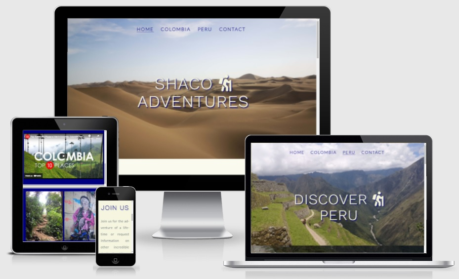
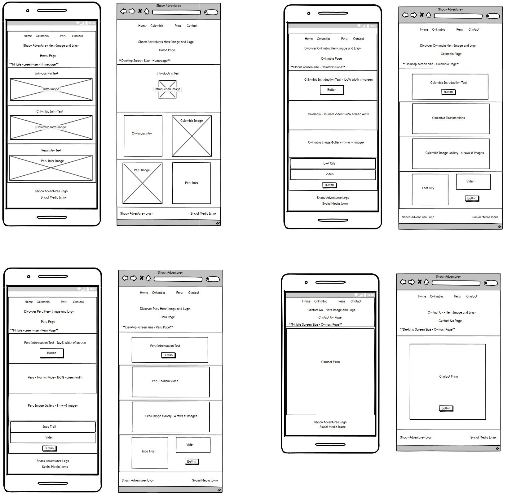

# Shaco Adventures

Shaco Adventures are a specialist in South American adventure travel. 
Colombia and Peru are among the amazing countries where they undertake 
regular Treks through premium destinations such as The Inca Trail and The lost 
City. 

This website has been created to help puplicise Shaco Adventures further and to help
showcase their upcoming treks and to highlight other areas of Colombia and Peru that 
are ready for an adventure. This website is targeted at those seeking an adventure
holiday and also those who would just like to discover these destinations at their own leisure.

Some of its key features include:

* Users can easily access information on both Colombia and Peru,
* Users can view photo galleries of available destinations,
* More information on these destinations is available via the clickable links,
* Users can view videos showcasing the available treks,
* Users can easily contact Shaco Adventures via the contact form to declare their interest
in up-coming treks and also seek information on other amazing destinations,
* Access to official Shaco Adventures social media is easily accessible via social links
where users can get even more information,
* The website is responsive and can be easily accessed and viewed on any device i.e. 
mobile, tablet or desktop.

## The Website

 

 

This website is hosted by GitHub pages and can be viewed at:  
https://shanecoen.github.io/code-institute-portfolio-1/index.html

 

## Contents

* [**The Design Process**](<#the-design-process>)
    * [Responsively Designed](<#responsively-designed>)
    * [Semantic HTML](<#semantic-html>)
    * [UX Design](<#ux-design>)
    * [Wireframes](<#wireframes>)
    * [Site Structure](<#site-structure>)
    * [Design Choices](<#design-choices>)
        * Typography
        * Colour Scheme
* [**Features**](<#features>)
    * [Existing Features](<#existing-features>)
        * [Common To All Pages](<#common-to-all-pages>)
            * Navigation Bar
            * The Landing Page Image
            * Footer
        * [Video And Images](<#video-and-images>)
            * Videos
            * Image Galleries
        * [The Contact Form](<#the-contact-form>)
    * [Future Features](<#future-features>)
* [**Technologies Used**](<#technologies-used>)
* [**Testing**](<#testing>)
    * [Code Validation](<#code-validation>)
    * [Website Responsiveness](<#website-responsiveness>)
    * [Browser Compatability](<#browser-compatability>)
    * [Additional Testing - Lighthouse](<#additional-testing---lightouse>)
    * [Known Bugs](<#known-bugs>)
        * Resolved Bugs
        * Unresolved Bugs
* [**Deployment**](<#deployment>)
    * [GitHub Pages](<#github-pages>)
    * [To Fork A Repository On GitHub](<#to-fork-a-repository-on-github>)
    * [Creating A Local Clone Of Website Files From GitHub](<#creating-a-local-clone-of-website-files-from-github>)
* [**Credits**](<#credits>)
    * [Media Used](<#media-used>)
    * [Website Content](<#website-content>)
    * [Code](<#code>)
* [**Acknowledgements**](<#acknowledgements>)

## **The Design Process**

### Responsively Designed:

This website has been designed Mobile First as priority and huge importance has been put into this area to ensure that it functions responsively on all devices be it mobile, tablet and desktop screen sizes.

### Semantic HTML:

Wherever possible Semantic HTML5 elements were used in order to have the HTML code structured corrently and to enure that the code is accessible to all users.

### UX Design:

It was designed using the 5 principles of UX Design (strategy, scope, structure, skeleton and surface) in order to develop a website that fully meets the user's needs.

### Wireframes:

Wireframes were an integral part of the design process for this website. They were used as a visual representation of the initial ideas for the architecture of the site i.e. the navigation, the organisation of all pages and features etc. It was very important to be able to visualise how this website would look and function whether it was in Mobile, Tablet or Desktop view. Balsamiq was used in the production of wireframes for this website and it helped greatly in the development process when the decison had to be made as to what features etc were to be included. Some of the wireframes used can be seen in the image below, this includes all four pages of website showing wireframe of mobile screen and desktop view side by side for each. (note: wireframe sizes are not to scale).

 

 

### Site Structure:

Shaco Adventures consists of four seperate pages i.e. Home page, Colombia, Peru and Contact page. The home page is the default landing page and all other pages are easily accessible from here via links on the navigation bar and large call to action buttons located futher down the page. The navigation bar and buttons are present on all four pages so navigation from one page to another is always accessible.

### Design Choices:

* Typography

The fonts chosen for this website were "Work Sans" for the headings and "Lato" for the body text. Both fonts had a fallback option of "Sans-Serif". These fonts were chosen as they work well together and are both easy to read for the user. Google Fonts was used to aquire these fonts.

* Colour Scheme

The colour scheme chosen for the website consists of navy (#000080), beige (#f5f5dc) and silver (#6c757d). These were chosen as they have a good contrast with one another and make viewing and interacting very accessible for the user.

 

[Back To Contents](<#contents>)

 

## **Features**

Shaco Adventures was responsively designed with the user in mind in that it is a very
welcoming and easy to use website. Users will instantly be able to naigate throughtout the site
easily and all interactive features such as the gallery and contact form are very user friendly. 

### Existing Features:

#### Common To All Pages:

* Navigation Bar

The Navigation Bar in this website in used in all 4 pages and is placed centrally at the top of the header image.
It allows for the user to easily navigate throughout the site and it is fully responsive and responds to all screen sizes.
The page that the user is currently on will be highlighted by a navy coloured underline. The Image below shows the Navigation bar in desktop screen size. 

 

 

* The Landing Page Image

Each page on this website has its own landing page image. These images are used to showcase the amazing scenery that awaits the user if they are to
visit Colombia or Peru with Shaco Adventures. They include a large text indicating what that individual page is about (i.e. Discover Colombia etc).

 

 

* Footer

The footer design is common to all pages. It give quick access to all Shaco Adventures social media pages i.e. Facebook, Twitter, Instagram and Youtube. 
These are inclued to enhance the users experience and allow them to interact with the company further. All links will open in a new tab.
It also includes the company logo which when clicked on will always bring the user back to the Home page. The below image show the footer in desktop mode and when it reponds
to a mobile screen size the logo will appear on top of the social media icons.

 

 

* Large Call To Action Buttons

These Call To Action Buttons can be found throughout this website. They are large in size and easily recognisible to the user that they are to be clicked and
are used to easily navigate between different sections of the website. They are a quick way for the user to easily go to the website section they desire.
They are bright in colour and when hovered over they change background and font colour and/ or enlarge slightly.

 

 

#### Video And Images:

* Videos

There is a large embedded video included in both Colombia.html and peru.html. These tourism videos are embedded from youtube are are used to highlight the most popular
travel locations in both countries. These videos are invaluable as they allow the user to see exactly what the various locations are like and they can then contact Shaco
Adventures to organise their own travel arrangements. There is also a video included in the Peru Inca Trail Trek section which shows more adventures that await the user.
All of these videos are controlled by the user via the controls provided (start, stop etc) and sound is optional. There are background videos included also in both of 
these pages which allows the user to admire the location in the background while navigating through the page. The background videos are hidden in smaller screen sizes to
allow for ease of use and to speed up loading times. All videos are responsivelly designed. In the image below: the embedded video can be seen on the left and the Inca 
Trail video is on the right. The background videos can be seen playing behind both of these videos.

 

 

* Image Galleries

There is a large image gallery included in both colombia.html and peru.html. They are located below the embedded video section on their respective pages.
They are responsivelly designed i.e. images appear in just one column when in mobile screen view and four when in desktop view. A number of images are hidden
in mobile view to allow for easier navigation. These images include a variety of amazing loctions for which the user can contact Shaco Adventures for information 
and/ or to declare their interest in taking part in an upcoming trek. When each image is hovered over its location will appear and clicking on these will take
the user to a differnt website with more information (these links will open in new tabs). Below a number of images can be seen showing the gallery on various 
screen sizes. (Left = Desktop screen, center = tablet and right = mobile).

 

 

#### The Contact Form:

This can be found on the contact.html page and there are also quick links located to this on colombia.html and peru.html. This form is used to allow the user to contact 
Shaco Adventures if and when they require any information on a number of locations in Colombia or Peru. It also allows them to notify the company of their interest
in an upcoming Inca Trail or Lost City trek. The user sends on their information via input fields in this form and any info they require on specific locations can be chosen
via the select and radio button options. Below a number of images can be seen showing the contact form on various 
screen sizes. (Left = Desktop screen, center = tablet and right = mobile).

 

 

### Future Features:

* Expand on the information provided in the individual country sections (colombia.html and peru.html). Provide much more information
and images for each individual location in these countries i.e. in peru locations such as Cusco, Arequipa, Huachachina and Lake Titicaca. 
At present there are photos of some of these locations and an external link for more info but in the future all of this would be provided via the Shaco Adventures website.

* Add additional Trek options and information such as for The Colca Canyon and Amazon Jungle Treks. Giving these trek options would entice more people to do 
business with Shaco Adventures.

* Expand into other countries in South America also such as Argentina, Brazil, Bolivia and Chile.

* Incorporate a shop section into the website where customers could purchase supplies for their upcoming trips and treks.

* Introduce a blog section where tips would be given for futre trekkers about how to prepare for treks, what they need etc. This blog would be an essential guide
for all website users.

 

[Back To Contents](<#contents>)

 

## **Technologies Used**

* [Balsamiq](https://balsamiq.com/)  - Used in the design process for the production of wireframes.
* [HTML5](https://html.spec.whatwg.org/) - Used to provide the website's structure.
* [CSS3](https://www.w3.org/) - Used to provide the website's styling.
* [Github](https://github.com/) - This was used to host and deploy the website.
* [Gitpod](https://www.gitpod.io/) - Provided the developement environment for the website.

 

[Back To Contents](<#contents>)

 

## **Testing**

### Code Validation:

* The code from this website has been validated using the [W3C HTML Validator](https://validator.w3.org/) to ensure that it complies with the standards set by the W3 Consortium.
* All four pages (index.html, colombia.html, peru.html and contact.html) have been tested and all have come back 100% clear of errors.
* The CSS code has been validated using the [W3C CSS Validator](https://jigsaw.w3.org/css-validator/) to ensure that its complies with all relevant standards and it has come back 100% clear of all errors and warnings.
* The Images below show the HTML validation results (top) and CSS validation results (bottom).

 

 

### Website Responsiveness:

This website has been tested at every single stage to ensure that is responded correctly to every device type and size i.e. desktop, tablet and mobile. Some of the device types used for testing included; lenovo IdeaPad 100 Laptop, Samsung Galaxy 7 inch tablet, Amazon Fire 6 inch tablet, Apple iPad 9.7 inch and a number of mobile phone brands such as Apple iPhone, Samsung and Huawei. Google Chrome DevTools and Firefox's responsive design mode were used etensivelly in these tests. Media queries were used in this websites design where required to ensure that every aspect responded as desired with regard to image rendering, layout, positioning etc. All responsiveness testing passed successfully.

### Browser Compatability:

This website was tested extensivelly using a number of different browsers (i.e. Google Chrome, Mozilla Firefox and Microsoft Edge) throughout its development. This was done to ensure that every aspect of the websites design, appearance, functionality and responsivness was compatible with these browsers.
Note: Safari was not available to the developer during this browser compatability testing.

### Additional Testing - Lighthouse:

While testing this website, good use was made of Chrome Dev Tools. One feature that was used extensivelly was [Lighthouse](https://developers.google.com/web/tools/lighthouse). This is a tool that is used to identify and fix common problems that can affect the sites performace, accessibility and user experience. It can generate a report (on both mobile and desktop devices) and give a score out of 100 on website perfromace (site loading performace), Accessibility, Best practices (does it conform to industry best practices) and SEO (is the site optimised for search engine result rankings). This was a very useful tool that helped to identify and resolve any bugs present from an early stage. The below image shows some of this websites current lighthouse scores with the left side showing colombia.html on a mobile device and the right side showing peru.html on a desktop screen.

 

 

### Known Bugs:

* Resolved Bugs

1. When testing the various website pages with the Lighthouse feature on Google Chrome Devtools it was found the video and image files included were slowing the
website down considerably on loading. As a result all videos and images were compressed and this resulted in much faster loading times. Background videos were
also hidden in mobile views for this reason.

* Unresolved Bugs

1. The form on contact.html is not fully functional. Due to the limitations of the content taught in this section of the Code Institute course the form does not function correctly once the submit button is clicked (i.e. the data does not push anywhere). This is an issue that would be resolved upon further progression into the course.

 

[Back To Contents](<#contents>)

 

## **Deployment**

### GitHub Pages:

This website was deployed using GitHub pages and it can be viewed at:  
https://shanecoen.github.io/code-institute-portfolio-1/index.html

In order to deploy this website a number of steps had to be undertaken;

1. Naviagte to [GitHub](https://www.github.com)
2. Login into your Github account with your username and password
3. Navigate to the "your repositories" section
4. Select the project to be deployed
5. Select "settings" from the options along the top menu
6. Once in settings a new menu wil appear on the left had side. Select the "pages" option. 
You will now be in the Github pages section where you can deploy your project. This page can
be seen in the image below.

 

 

7. In order to now deploy your website select either "master" or "main" in the "Source: Branch" option and click "save".
8. Github will then refesh the page and give details of the newly deployed project.

### To Fork A Repository On GitHub:

A fork is a copy of a repository. Forking a repository allows you to freely experiment with changes without affecting the original project. In order to fork this repository follow the steps below;

1. Log into your GitHub account and locate the repository your wish to fork.
2. On the top right corner of the repository page locate the "Fork" option.
3. Click this button and a copy of the original repository will now be created in your GitHub account.

### Creating A Local Clone of Website Files From GitHub:

1. Log into your GitHub account and locate the repository you wish to clone.
2. When in the repository, click on the "code" tab.
3. When the menu opens; select HTTPS and copy the link on right side.
4. Naviagte to an IDE and open GIT bash.
5. Change the current working directory to the location where you want the cloned directory to be made.
6. Type "git clone"
7. Paste the URL of the code you have copied from GitHub,
8. Press enter and your local clone will have been created.

 

[Back To Contents](<#contents>)

 

## **Credits**

### Media Used:

* All images used in this website (including background images) are owned by the developer (Shane Coen). They were all compressed using the website [tinyping.com](https://www.tinypng.com) in order to make their size more suitable for this website.
* The video used in peru.html for the "Inca Trail" section is owned by the developer as are both background videos used in colombia.html and peru.html. All three of these videos were compressed using the website [MP4compress.com](https://www.mp4compress.com/) and the website [Zamzar.com](https://www.zamzar.com/convert/mp4-to-ogg/) was used to convert them to .ogg format. Two formats of these videos were uploaded in order to allow them to work on different browsers i.e. .mp4 and .ogg.
* The two embedded videos used in the website are from a youtube source, they are are follows; [Colombia tourism video](https://www.youtube.com/watch?v=xzy4umDtA88) and
[Peru tourism video](https://www.youtube.com/watch?v=BHuledXYjKw)

### Website Content:

* All text content used in this website is owned by the developer.
* [Font Awesome](https://fontawesome.com/) provided the Icons used in the header logo text and footer section in all four pages. They also provided the social media icons that are used in the footer sections. 
* The fonts used were provided by [Google Fonts](https://fonts.google.com/). 
* The wireframes used for design purposes were designed using [Balsamiq](https://balsamiq.com/).

### Code:

* When designing the image gallery a text ovelay was required to appear on hover. Inspiration for this was taken from [W3 Schools](https://www.w3schools.com/howto/howto_css_image_overlay.asp) but was edited to suit the websites requirements.

## **Acknowledgements**

This website was completed as part of Code Institute's Diploma in Full Stack Software Development program and was completed in February 2022. I wish to thank my mentor Precious Ijege for all the time and effort given to me during the time spent on this project. I also wish to acknowledge the slack community and all those at Code Institute for all their help and support.

Shane Coen, 2022.

 

[Back To Contents](<#contents>)