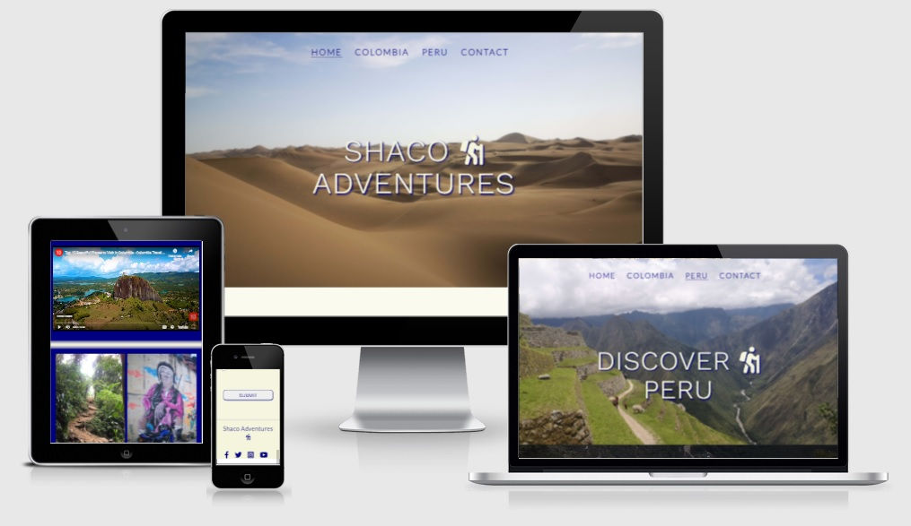
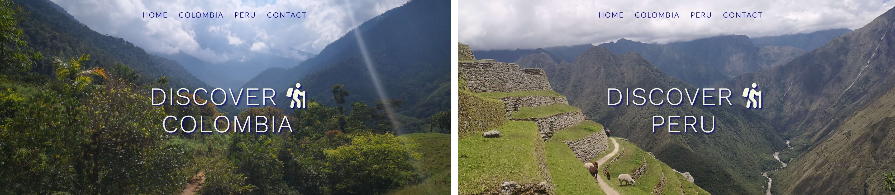
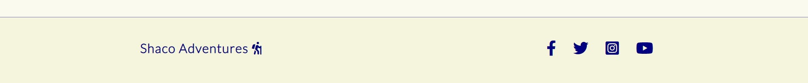
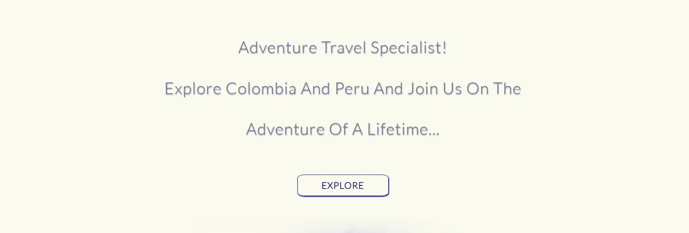
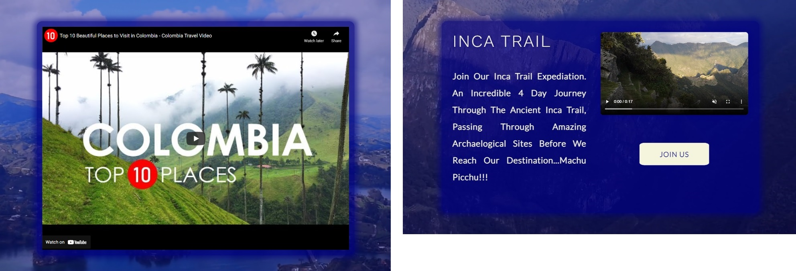
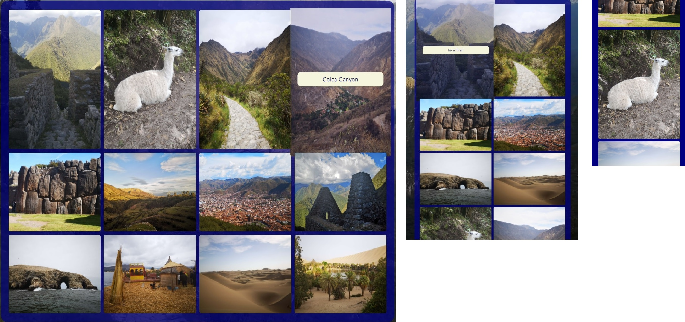

# Shaco Adventures

Shaco Adventures are a world leader in South American adventure travel. 
Colombia and Peru are among their specialist destinations where they undertake 
regular Treks through premium destinations such as The Inca Trail and The lost 
City. 

This website has been created to help puplicise Shaco Adventures further and to help
showcase their upcoming treks and to highlight other areas of Colombia and Peru that 
are ready for an adventure. This website is targeted at those seeking an adventure
holiday and also those who would just like to discover these destinations at their own leisure.

Some of its key features include:

* Users can easily access information on both Colombia and Peru,
* Users can view photo galleries of available destinations,
* More information on these destinations is available via the clickable links,
* Users can view videos showcasing the available treks,
* Users can easily contact Shaco Adventures via the contact form to declare their interest
in up-coming treks and also seek information on other amazing destinations,
* Access to official Shaco Adventures social media is easily accessible via social links
where users can get even more information,
* The website is responsive and can be easily accessed and viewed on any device i.e. 
mobile, tablet or desktop.

## The Website

 

 
This website is hosted by GitHub pages and can be viewed at 
https://shanecoen.github.io/code-institute-portfolio-1/index.html

 

## Contents 

 

1. UX Design
* jjjj
* jjjj
* jjjj
2. Features
* jjjj
* jjjj
* jjjj

 

## Features

 

Shaco Adventures was responsively designed with the user in mind in that it is a very
welcoming and easy to use website. Users will instantly be able to naigate throughtout the site
easily and all interactive features such as the gallery and contact form are very user friendly. 

 

### Existing Features:

 

#### Common To All Pages:

 

* Navigation Bar

The Navigation Bar used in this website in used in all 4 pages and is placed centrally at the top of the header image.
It allows for the user to easily navigate throughout the site and it is fully responsive and responds to all screen sizes.
The page that the user is currently on will be highlighted by a navy coloured underline. The Image below shows the Navigation bar in desktop screen size. 

 

 

* The Landing Page Image

Each page on this website has its own landing page image. These images are used to showcase the amazing scenery that awaits the user if they are to
visit Colombia or Peru with Shaco Adventures. They include a lage text indicating what that individual page is about (i.e. Discover Colombia etc).

 

 

* Footer

The footer design is commin to all pages. It give quick access to all Shaco Adventures social media pages i.e. Facebook, Twitter, Instagram and Youtube. 
These are inclued to enhance the users experience and allow them to interact with the company further. All links will open in a new tab.
It also includes the company logo which when clicked to always bring the user back to the Home page. The below image show the footer in desktop mode and when it reponds
to a mobile screen size the logo will appear on top of the social media icons.

 

 

* Large Call To Action Buttons

These Call To Action Buttons can be found throughout this website. They are large in size and easily recognisible to the user that they are to be clicked and
are used to easily navigate between different sections of the website. They are a quick way for the user to easily go to the website section they desire.
They are bright in colour and when hovered over they change background and font colour and/ or enlarge slightly.

 

 

#### Video and Image Galleries:

 

* Videos

There is a large embedded video included in both Colombia.html and peru.html. These tourism videos are embedded from youtube are are used to highlight the most popular
travel locations in both countries. These videos are invaluable as they allow the user to see exactly what the various locations are like and they can then contact Shaco
Adventures to organise their own travel arrangements. There is also a video included in the Peru Inca Trail Trek section which shows more adventures that await the user.
All of these videos are controlled by the user via the controls provided (start, stop etc) and sound is optional. There are background videos included also in both of 
these pages which allows the user to admire the location in the background while navigating through the page. The background videos are hidden in smaller screen sizes to
allow for ease of use and to speed up loading times. In the image below: the embedded video can be seen on the left and the Inca Trail video is on the right. The background
videos can be seen playing behind both of these videos.

 

 

* Images Galleries

There is a large image gallery included in both colombia.html and peru.html. They are locacted below the embedded video section on their respective pages.
They are responsivelly designed i.e. images appear in just one column when in mobile screen view and four when in desktop view. A number of images are hidden
in mobile view to allow for easier navigation. These images include a variety of amazing loctions for which the user can contact Shaco Adventures for information 
and/ or to declare their interest in taking part in an upcoming trek. When each image is hovered over its location will appear and clicking on these will take
the user to a differnt website with more information (these links will open in new tabs). Below a number of images can be seen showing the gallery on various 
screen sizes. (Left = Desktop screen, center = tablet and right = mobile).

 

 

### Future Features

